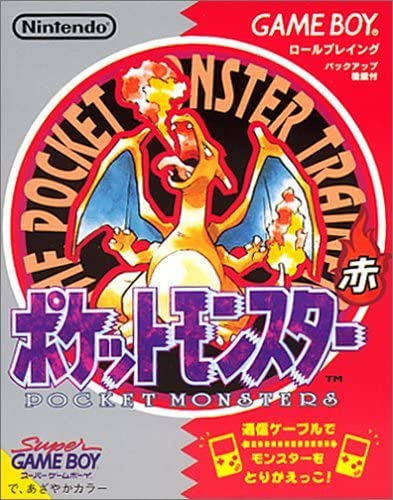
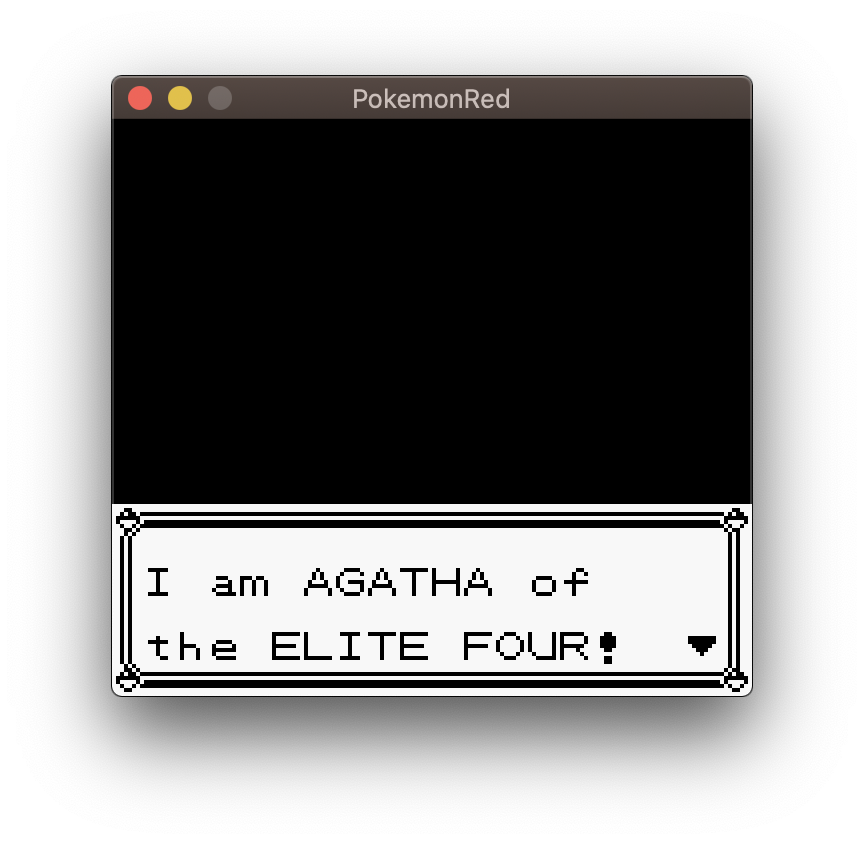
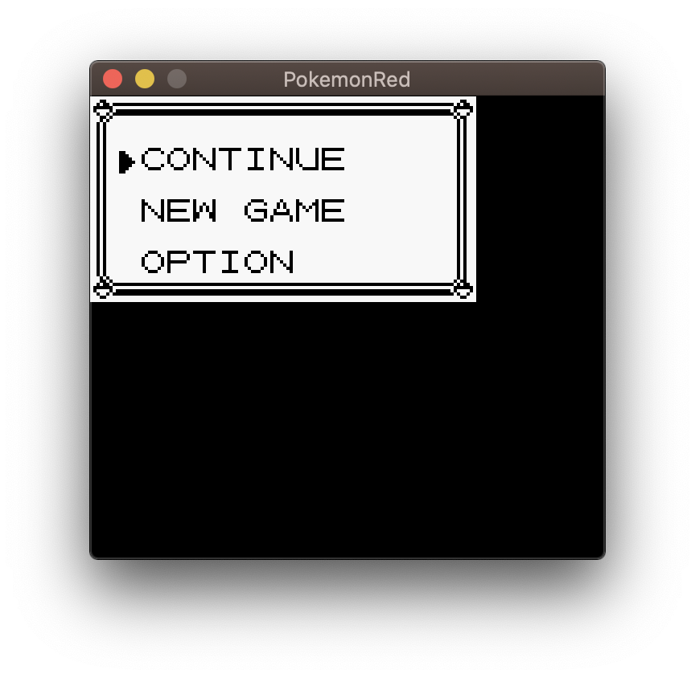
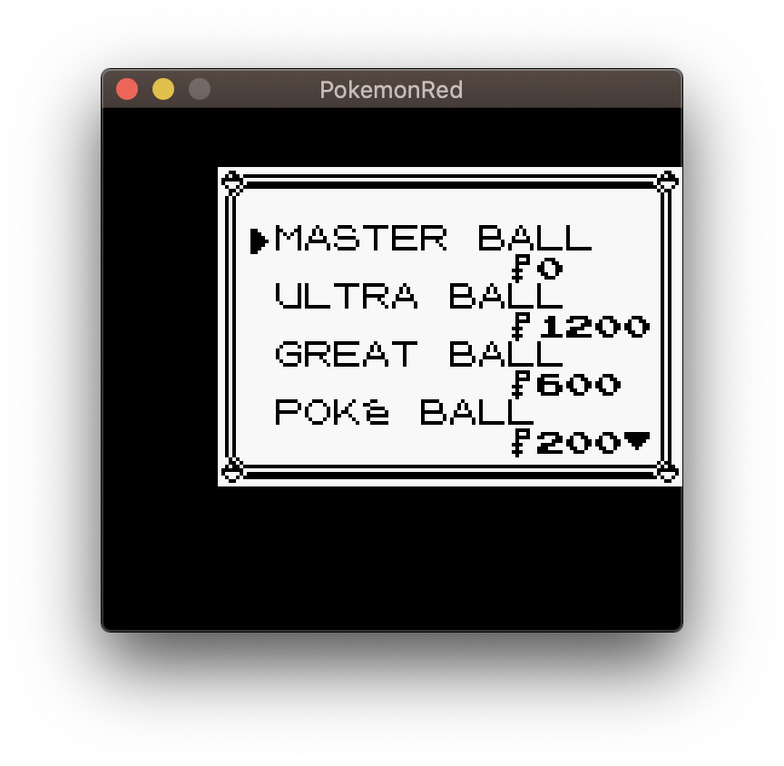
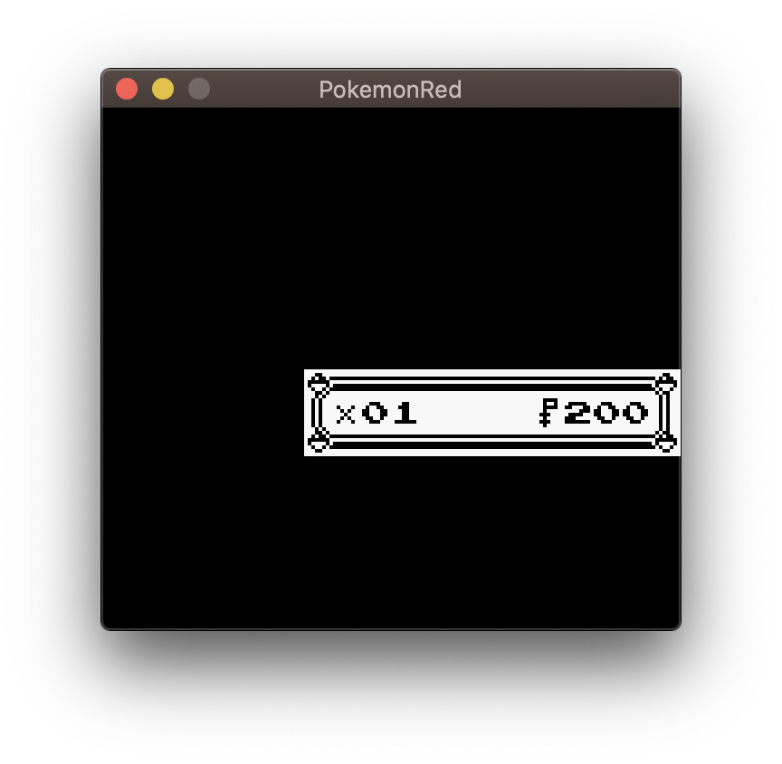

# PokémonRed

## 🔰 Description

**🚧 WARNING: This project is unofficial!! 🚧**

This project is open source re-implementation of [Pokémon Red](https://www.pokemon.com/us/pokemon-video-games/pokemon-red-version-and-pokemon-blue-version/).

The ROM version is not Japanese but English.

## 🏜 Roadmap

This project is in the middle of development and is currently creating the underlying system part.  
For example, text drawing, sound playback, and combat systems.

## 🏞 Screenshots

Screenshots as of v0.0.2 (Text engine and Menu engine)

 &nbsp;&nbsp; 

 &nbsp;&nbsp; 